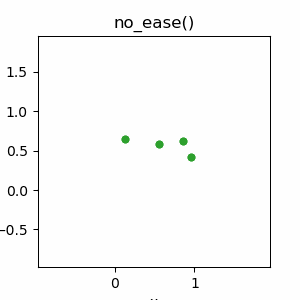
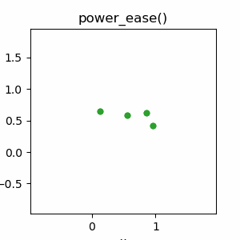
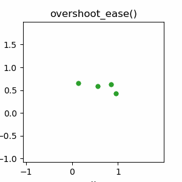
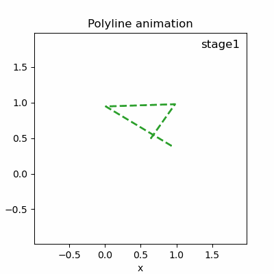
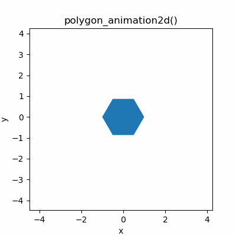
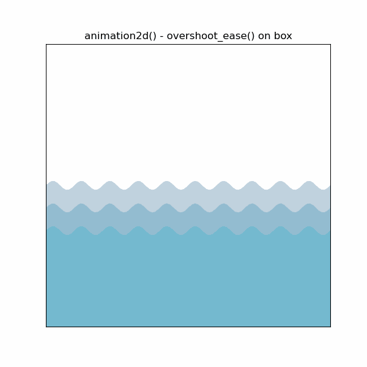

# Easing Animations with Python
<!------>
 
Easing is a package meant to make easy animations in Python, via matplotlib's module animation. The package is built around an "easing" class, which has a number of methods that build from [Nicholas Rossi's module easing](https://github.com/NicholasARossi/Easing-Animations-with-Python). This iteration of the module aims at easy scaling of animation features, allowing for multi-component (points, lines and polygons) animations.  


# Installation
To gain access to the package, simply clone/download the repository and add the corresponding directory to your PYTHONPATH. 
 

# Dependencies
Basic dependencies include:
* numpy
* pandas
* matplotlib

In order to render any of these animation, you will also need:

* FFMPEG for .mp4 renders 
* Imagekick for .gif renders


# Quick-start guide
With the module `easing`, an animation needs to be created in three steps:

1. &ensp;Upload the data into an instance of the `Eased` class. 
2. &ensp;Apply an easing method onto the instance.
3. &ensp;Create the animation.

A thorough example can be found in `examples/ease_methods.ipynb`. Here is a quick walkthrough:

## Step 1: Uploading the data
Prior to creating animation, you need to create a class by loading the data itself. The input data must be either a `numpy.array` or `pandas.DataFrame`. A DataFrame is generally preferred, as it allows keyframe labelling. 

```python
data = np.random.random((2,8))
data_df = pd.DataFrame(data)

eased_data = easing.Eased(data_df)
```

## Step 2: Apply an easing method
Different animation methods can then be called on an `Eased` instance: 
* **no_ease**: Transition without interpolation.
* **power_ease**:  Transition based on powers (e.g. linear, quadratic, cubic etc.).
* **overshoot_ease**: Bouncy transition by overshooting the target value.

```python
eased_data.no_ease()
eased_data.power_ease()
eased_data.overshoot_ease()
```

   


## Step 3: Create the animation
From an `Eased` instance three types of animations can be created: `scatter_animation2d`, `polyline_animation2d`, `polygon_animation2d`. An animation can also be created with the `ease.animation2d()` method, which allows multiple types of data to be animated simultaneously. More on that later. 

* *scatter_animation2d*: &ensp;Animates a scatter plot.
* *polyline_animation2d*:  &ensp;Animates a polyline.
* *polygon_animation2d*:  &ensp;Animates a polygon.

  


# Multi-component animations
The `Eased` class allows for multi-component animations, where multiple types of data can be animated simultaneously, via the `ease.animation2d()` method. This method has two mandatory parameters: a list of `Eased` instances and a list of strings representing the desired the animation type for each eased instance. Options are *points*, *line* and *polygon*. 

 